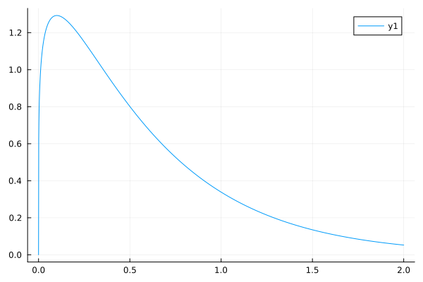

# The STAT2004 Guide to The Julia Programming Language
STAT2004 doesn't enforce the use of any particular programming language but it
looks like most of the example code will be in R. This is fine, except for the
fact that I don't like R very much. Fortunately, Julia (a language that I do 
like very much) offers packages with similar statistical capabilities. If
you are like me and also don't like R very much, this guide provides
some examples of performing basic statistical calculations in Julia
to help kickstart your escape from R. I am assuming you are already
familiar with the fundamentals of Julia programming but have not yet
used any of the statistics related packages.

## Packages
There are four main packages that we will be utilising throughout this
guide, in later parts I will already assume they have been imported.
You can easily import them like this:
```julia
using Statistics, Distributions, CSV, DataFrames
```
If a package hasn't been downloaded yet, open up the REPL and enter
package mode with the `]` key. You can then add the package with
`add [package name]` For example to add Distributions.jl just type:
```julia
(@v1.10) pkg> add Distributions
```
These packages provide us with the following functionality:
- `Statistics` gives basic statistical functions, we will mostly use
it for quickly getting sample statistics like $μ$ and $s$
- `Distributions` allows us to create a wide range of common 
probability distributions (Normal, T, Poisson, Chi-Square, etc). We can
then sample from these distributions or get probabilities or quantiles.
- `CSV` is a simple package that lets us read from and write to CSV files
and interacts nicely with our final package
- `DataFrames` introduces a `DataFrame` type for storing structured
data in a table like format, similar to dataframes in R.

## Sampling from a Distribution
At this point you could probably just go and read the official
documentation for each of these packages and figure all of this out yourself
but sometimes some specific examples can be helpful so here we go.

A common and basic task that we might want to perform is taking a 
random sample from a theoretical distribution. Let's take two 10-element
samples from a standard normal distribution and store them in a `DataFrame`.
```julia
# create a normal distribution with μ=0 and σ=1
Z = Normal(0, 1);

# take a 10 element random sample from our distribution (twice)
trial1 = rand(Z, 10)
trial2 = rand(Z, 10)

# put our results into a DataFrame
# we give the columns the same name as the variables
data = DataFrame("trial1" => trial1, "trial2" => trial2)
```
If you have a look at your DataFrame (with `print` or `show` or similar) it
will appear something like this:
```
 Row │ trial1     trial2
     │ Float64    Float64
─────┼──────────────────────
   1 │  0.285029  -1.23044
   2 │  0.557921  -0.143778
   3 │  0.546552   1.17303
   4 │ -1.61442    0.348941
   5 │  0.835602   0.292664
   6 │ -0.184307  -0.953991
   7 │ -0.541116   2.16324
   8 │ -0.321959   1.83162
   9 │  0.894896  -0.182744
  10 │ -0.715567   2.16571
```
If you want to store that data you can easily write it to a CSV:
```julia
CSV.write("NormalData.csv", data)
```
This example just used a normal distribution, but Distributions.jl
supports a whole bunch of different distributions. Here's the syntax
for creating a few common ones.
```julia
Normal(μ, σ)
TDist(v) # v is the degrees of freedom
Poisson(λ)
Chisq(v) # v is the degrees of freedom
Gamma(α, θ)
Exponential(θ)
```
If you want to create a distribution that isn't listed here, check
out the [Distributions.jl Documentation](https://juliastats.org/Distributions.jl/stable/).

## Calculating a Confidence Interval
Let's say that we just received the CSV from the last section and we
know that the data was taken from a normal distribution with $σ=1$.
We can use Julia to help calculate a 95% confidence interval for $μ$.
```julia
# set the confidence level
confidence = 0.95
α = 1 - confidence

# load the sample data, the DataFrame argument indicates that we will load
# it directly into a DataFrame
data = CSV.read("NormalData.csv", DataFrame)

# get some sample statistics (we will just do the CI for trial 1)
x̄ = mean(data.trial1)
s = std(data.trial1)
n = length(data.trial1)

# find the margin of error
# (Normal() is shorthand for a standard normal distribution)
z = quantile(Normal(), 1 - α/2)
me = z*s/√n

# create a confidence interval
lower = x̄ - me
upper = x̄ + me
CI = (lower, upper)
@show CI
```
My confidence interval ended up looking like this:
```
CI = (-0.525214742704619, 0.9428982646593576)
```
The important pieces here are the `CSV.read` and `quantile` functions.
`quantile` can be used for any of the distributions provided by
Distributions.jl. It takes a distribution and a probability and returns
the relevant quantile, here we are using it in a similar way to R's
`qnorm`. 

Additionally, this example shows how we can easily access the columns
of a DataFrame. Each column is just a vector (`Vector{Float64}` in
this case) which is why we can call familiar functions like `length`
to get the sample size.

Hopefully this also gives you enough information to be able to perform
a hypothesis test in Julia (very similar process).

## More Tricks with Distributions
So far we have only used our distributions to get random samples and
calculate quantiles. There are a few other useful things that we can
do with a distribution.
```julia
# I'll use a gamma distribution here to change it up a bit
α = 1.2
θ = 0.5
my_gamma = Gamma(α, θ)

# get the parameters
@show params(my_gamma)

# evaluate the cdf at a quantile (similar to R's pgamma)
@show cdf(my_gamma, 0.5)

# evaluate the pdf at a point (similar to R's dgamma)
@show pdf(my_gamma, 0.5)

# calculate population parameters directly with Statistcs.jl
@show mean(my_gamma)
@show std(my_gamma)
```
We can also combine the `pdf` function with Plots.jl to visualise
our distribution
```julia
using Plots
# using an anonymous function that takes a point and evaluates our pdf at that point
plot(x->pdf(my_gamma, x), 0:0.001:2)
```


## Some Notes on RCall
Julia provides an `RCall` package to use functions directly from R in your
Julia code. I usually prefer to stick to pure Julia code but if you're feeling
lost trying to replicate some R functionality, this might be helpful. The 
main ways to use it are as follows:

With the package imported you can type `$` in the Julia REPL to enter R mode:
```R
R> pnorm(0)
[1] 0.5
```
Or you can call R functions from Julia with R strings:
```julia
julia> R"pnorm(0)"
[1] 0.5
```
For anything more advanced, check [the documentation](https://juliainterop.github.io/RCall.jl/stable/).
